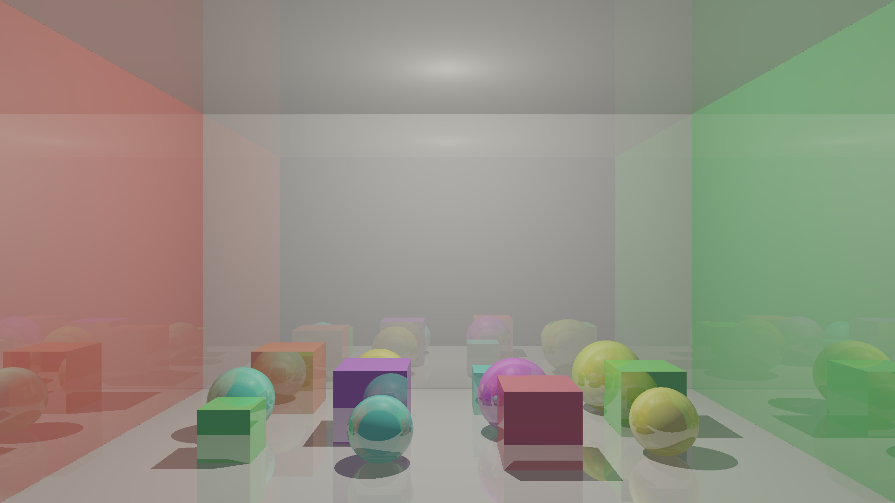

# Raytracing scene demo — 16:9 Cornell box with 12 cubes and spheres

A headless (no window) macOS command-line demo exercising campello_gpu's ray
tracing API end to end: BLAS/TLAS creation and building, BLAS reuse across
many TLAS instances, a ray tracing pipeline, `RayTracingPassEncoder`, hard
shadows, and up to 3 chained mirror-reflection bounces off every surface.

Scene: a 5-wall, 16:9-proportioned Cornell box (red/green side walls, white
floor/ceiling/back wall) lit by a single point light near the ceiling, with a
4x3 jittered grid of 12 foreground objects (6 cubes + 6 spheres,
checkerboarded, procedurally colored) filling the floor. All 6 cubes reuse
one BLAS and all 6 spheres reuse one icosphere BLAS via different TLAS
instance transforms — only 7 BLAS total for 17 TLAS instances. Every
surface — walls, cubes, and spheres alike — shares the same reflectivity
(`kReflectivity` in scene.metal), giving the whole box a "hall of mirrors"
look. See `main.cpp` for the full setup and `scene.metal` for the shading
model.



## Build & run

Requires Xcode's Metal toolchain (`xcodebuild -downloadComponent
MetalToolchain` if `xcrun metal` reports it's missing) and campello_gpu built
as a shared library (e.g. via `cmake -B build -DBUILD_INTEGRATION_TESTS=ON &&
cmake --build build --target campello_gpu`, from the repo root).

```bash
# 1. Compile the ray tracing shader.
xcrun -sdk macosx metal    -c scene.metal -o scene.air -std=metal3.0
xcrun -sdk macosx metallib scene.air -o scene.metallib

# 2. Compile the demo against the campello_gpu build directory.
clang++ -std=c++20 -I ../../../inc -I <build-dir> main.cpp \
    -L <build-dir> -lcampello_gpu \
    -Wl,-rpath,<build-dir> \
    -framework Metal -framework Foundation -framework QuartzCore -lobjc \
    -o raytracing_scene_demo

# 3. Render. Produces a binary PPM; convert to PNG with `sips` if desired.
./raytracing_scene_demo scene.metallib cornell_scene.ppm
sips -s format png cornell_scene.ppm --out cornell_scene.png
```

## Benchmarking

An optional third argument sets how many timed iterations to run after the
image is written (default 200; pass `0` to skip). Optional fourth/fifth
arguments set the output resolution (default 1920x1080, matching the box's
16:9 proportions):

```bash
./raytracing_scene_demo scene.metallib cornell_scene.ppm 500
./raytracing_scene_demo scene.metallib cornell_scene.ppm 500 900 900
```

This re-records and resubmits just the ray tracing dispatch (record + submit
+ GPU execution + CPU wait, no texture readback) in a loop, after 5 discarded
warmup iterations, and prints min/mean/median/P95/max/stddev plus fps and
Mrays/s. One-time setup cost (BLAS/TLAS build, pipeline compilation, texture
allocation) is excluded — this measures steady-state per-frame cost only.

Sample result on an Apple A18 Pro, 1920x1080, 500 iterations, 17 instances
(5 walls + 12 foreground objects), with every surface reflective (always
uses the full 3-bounce budget):

```
Min:         10.8 ms
Mean:        11.3 ms
Median:      11.0 ms
P95:         12.5 ms
Max:         13.6–13.8 ms
Stddev:      ~0.6 ms
Throughput:  ~88 fps, ~183 Mrays/s
```

For comparison: with only spheres reflective (walls/cubes not), most rays
terminated after 1 bounce and this same scene ran at ~4.6 ms mean / ~218 fps
— making every surface reflective costs roughly 2.4x the frame time, since
now every ray path uses the full bounce budget (4 intersect + 4 shadow-ray
tests per pixel) instead of stopping early at the first non-reflective hit.
Going from the original 7-instance, sphere-only-reflective scene to this one
(~2.6 ms) is about a 4.3x total slowdown.

## Notes

- Wall instance IDs 0–4 and the foreground grid layout (`kFgStart`,
  `kGridCols`, and the checkerboard parity `(row+col)%2`) are duplicated as
  constants in both `main.cpp` (TLAS instance transforms) and `scene.metal`
  (shading lookup) — see the comments at each definition.
- Shading uses hardcoded per-instance/per-geometry normals for the flat
  walls and cube faces (cubes are only ever scaled + translated, never
  rotated, so object-space face normals equal world-space ones). Sphere
  normals are computed analytically per-instance from
  `intersection_result::object_to_world_transform` (requesting Metal's
  `world_space_data` intersection tag) rather than a hardcoded center, so
  all 6 spheres can share one BLAS despite sitting at different positions.
- Per-object color comes from a deterministic hash of `instance_id`
  (`hashColor` in scene.metal) — a rainbow palette with no extra buffer
  binding needed, rather than a real material/color buffer.
- The single `rayGenMain` compute kernel does everything (primary trace,
  shadow ray, up to 3 chained reflection bounces off every surface):
  campello_gpu's Metal backend implements `RayTracingPassEncoder` as a
  compute pass, not a hardware recursive pipeline, so hit-group shaders are
  never invoked for triangle geometry — only the ray generation kernel runs.
